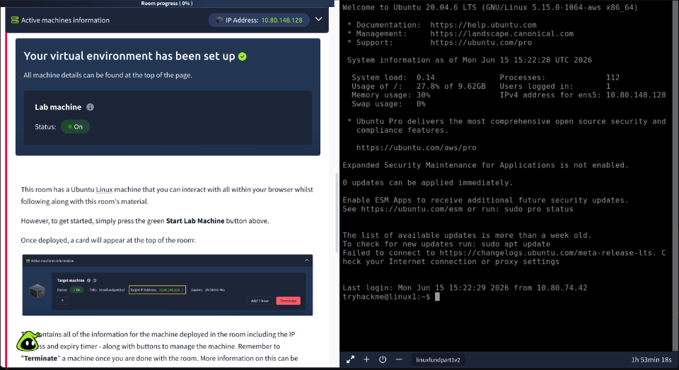

# Linux Fundamentals Part 1

- TryHackMe: [Linux Fundamentals Part 1](https://tryhackme.com/room/linuxfundamentalspart1)
- Difficulty: Easy
- Estimated time: 20 minutes
- Topics: `Linux`, `terminal`, `filesystem`, `find`, `grep`, `shell operators`



Room icon: [TryHackMe CDN](https://cdn-images.tryhackme.com/room-icons/linuxfundamentalspart1-1785241447142.png)

> Use the commands only on the authorized TryHackMe machine. Terminate the lab machine when you finish.

## Objective

This room introduces Linux through an interactive Ubuntu machine. It covers basic filesystem navigation, file searching, recursive content searches, and shell operators.

## Linux background

Linux is an open-source operating system family used in servers, websites, phones, embedded devices, point-of-sale systems, vehicles, and critical infrastructure.

The first Linux kernel was released in **1991**. Ubuntu and Debian are examples of Linux distributions. This room uses Ubuntu.

## Starting the machine

Start the lab machine from the room. The browser-based terminal provides a shell prompt similar to:

```text
tryhackme@linux1:~$
```

The deployed machine displays connection information and an expiry timer. Stop or terminate the machine after completing the exercises.

## First commands

### `echo`

Print text to the terminal:

```bash
echo TryHackMe
echo "Hello Friend!"
```

The answer for printing `TryHackMe` is:

```bash
echo TryHackMe
```

### `whoami`

Display the current user:

```bash
whoami
```

Run this on the deployed machine rather than relying on a different Linux installation, because the username is environment-specific.

## Filesystem navigation

| Command | Meaning | Example |
| --- | --- | --- |
| `ls` | List directory contents | `ls` |
| `cd` | Change directory | `cd Pictures` |
| `cat` | Concatenate and display file contents | `cat todo.txt` |
| `pwd` | Print working directory | `pwd` |

### List files with `ls`

```bash
ls
ls Pictures
```

### Change directories with `cd`

```bash
cd Pictures
ls
cd ..
```

`..` refers to the parent directory. An absolute path can also be used:

```bash
cd /home/tryhackme/Documents
```

### Read files with `cat`

```bash
ls Documents
cat Documents/todo.txt
```

`cat` is short for **concatenate**. It is commonly used to output text files, but it should not be used to expose sensitive data outside an authorized lab.

### Print the current path with `pwd`

```bash
pwd
```

This is useful after changing directories because it displays the full path of the current working directory.

## Searching for files

### `find`

Search for a file by name:

```bash
find -name passwords.txt
```

Search for all text files below the current directory:

```bash
find -name '*.txt'
```

Search from a specific location:

```bash
find /home/tryhackme -name '*.txt'
```

### `grep`

Search file contents for a string:

```bash
grep "81.143.211.90" access.log
```

Search recursively through a directory:

```bash
grep -R "PRETTY_NAME" /etc/
```

For the room’s flag task, search the provided log file for the `THM` prefix:

```bash
grep "THM" /home/tryhackme/access.log
```

The flag is intentionally not reproduced here:

```text
THM{REDACTED}
```

## Shell operators

### `&`

Run a command in the background:

```bash
long_running_command &
```

### `&&`

Run the second command only if the first succeeds:

```bash
command1 && command2
```

### `>`

Redirect output and overwrite the destination file:

```bash
echo password123 > passwords
cat passwords
```

### `>>`

Append output to a file without overwriting existing content:

```bash
echo tryhackme >> passwords
cat passwords
```

The main difference is that `>` replaces the file contents, while `>>` adds to the end.

## Answer summary

| Topic | Answer or command |
| --- | --- |
| First Linux kernel release | 1991 |
| Print `TryHackMe` | `echo TryHackMe` |
| Current user | Run `whoami` on the deployed machine |
| Current directory | Run `pwd` |
| Search for `passwords.txt` | `find -name passwords.txt` |
| Search recursively | `grep -R "text" /path` |
| Run in background | `&` |
| Conditional command chaining | `&&` |
| Overwrite a file | `echo password123 > passwords` |
| Append to a file | `echo tryhackme >> passwords` |
| Room flag | `THM{REDACTED}` |

## Conclusion

Linux becomes much easier to use once filesystem navigation and shell commands become familiar. The core workflow from this room is:

1. Inspect a directory with `ls`.
2. Move with `cd`.
3. Confirm the location with `pwd`.
4. Read a file with `cat`.
5. Search names with `find`.
6. Search contents with `grep`.
7. Combine commands with shell operators.
