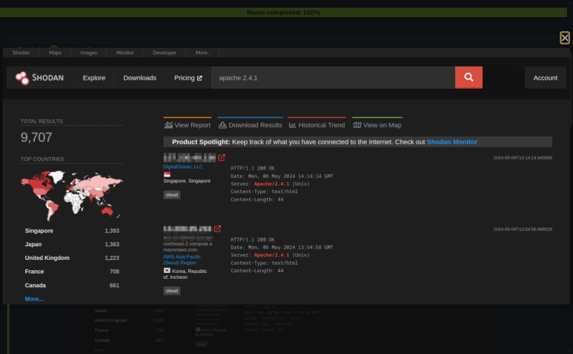

# Search Skills

- TryHackMe: [Search Skills](https://tryhackme.com/room/searchskills)
- Difficulty: Easy
- Estimated time: 60 minutes
- Topics: `search engines`, `OSINT`, `threat intelligence`, `CVE`, `technical documentation`


Room icon source: [TryHackMe CDN](https://cdn-images.tryhackme.com/room-icons/searchskills-1785241452249.png)

> This walkthrough is for authorized research and training. Do not collect or use personal information, scan systems, or exploit vulnerabilities without permission.

## Objective

This room develops practical research skills for cybersecurity. It focuses on evaluating sources, using search operators, exploring specialized search engines, reading official documentation, and finding vulnerability information.

## Evaluating search results

Internet search results are not automatically reliable. Evaluate a source using four checks:

- **Source**: Identify the author or organization and its expertise.
- **Evidence and reasoning**: Check whether claims are supported by facts and logical arguments.
- **Objectivity and bias**: Look for balanced information and undisclosed agendas.
- **Corroboration and consistency**: Confirm important claims with multiple independent, reputable sources.

A cryptographic method or product that is presented as secure but is actually bogus or fraudulent is commonly called **snake oil**.

## Search engines and operators

Search engines can be much more useful when queries are precise. Common Google operators include:

| Operator | Purpose | Example |
| --- | --- | --- |
| `"exact phrase"` | Search for an exact phrase | `"passive reconnaissance"` |
| `site:` | Limit results to a domain | `site:tryhackme.com success stories` |
| `-` | Exclude a word or phrase | `pyramids -tourism` |
| `filetype:` | Search for a specific file type | `filetype:pdf "cyber warfare report"` |

To limit a search to PDF files containing the terms *cyber warfare report*, use:

```text
filetype:pdf "cyber warfare report"
```

The exact result count for broad searches can change over time, so treat numbers shown in lesson examples as time-dependent observations.

## Specialized search engines

### Shodan

[Shodan](https://www.shodan.io/) indexes Internet-connected devices and services. It can help identify exposed technologies, service versions, and device banners.



Source: [TryHackMe Search Skills](https://tryhackme.com/room/searchskills)

Example query:

```text
apache 2.4.1
```

For country-ranking questions, run the room’s query in Shodan and inspect the result distribution at the time of solving. These results can change as Shodan’s index changes.

### Censys

[Censys](https://search.censys.io/) focuses on Internet hosts, websites, certificates, and other Internet assets. Typical uses include domain enumeration, certificate discovery, and exposure auditing.

### VirusTotal

[VirusTotal](https://www.virustotal.com/) compares files and URLs against multiple security engines. A hash can be searched to review existing scan results, vendor detections, and community context.

Do not upload confidential files or sensitive URLs to public analysis services without authorization.

### Have I Been Pwned

[Have I Been Pwned](https://haveibeenpwned.com/) checks whether an email address appears in known data breaches. Use it only for accounts and addresses you are authorized to investigate.

## Vulnerabilities and exploits

### CVE

The [Common Vulnerabilities and Exposures](https://www.cve.org/) program assigns standardized identifiers to publicly known vulnerabilities. The [National Vulnerability Database](https://nvd.nist.gov/) provides additional technical information, severity data, references, and affected products.

For example, `CVE-2024-29988` is a unique identifier that can be used to locate the relevant vulnerability record.

### Exploit Database and GitHub

[Exploit Database](https://www.exploit-db.com/) indexes exploit code and proof-of-concept material. GitHub can also contain tools and research related to vulnerabilities.

Always confirm that you have explicit permission before testing an exploit. A public proof of concept is not permission to target a system.

The utility associated with `CVE-2024-3094` is **xz**, specifically the xz Utils package and its malicious backdoor incident.

## Technical documentation

Official documentation is usually the most reliable source for product behavior and command syntax. Useful examples from this room include:

- [Snort documentation](https://www.snort.org/documents)
- [Apache HTTP Server documentation](https://httpd.apache.org/docs/)
- [PHP documentation](https://www.php.net/manual/en/index.php)
- [Node.js documentation](https://nodejs.org/docs/latest/api/)
- [Microsoft Learn](https://learn.microsoft.com/)

Linux commands can be explored through manual pages:

```bash
man ip
man ss
```

The command `ss` stands for **socket statistics** and is commonly used as the modern replacement for `netstat` on Linux. The command `cat` stands for **concatenate**.

On Windows, the `netstat` parameter that displays the executable associated with each active connection and listening port is:

```text
-b
```

## Social media and public information

Social media can provide useful professional and technical context, but it can also expose sensitive personal information. Use only lawful, ethical, and authorized research methods.

- **LinkedIn** is useful for researching an employee’s professional and technical background.
- **Facebook** may contain personal information such as schools, but this should only be checked with appropriate authorization and respect for privacy.

Never use discovered personal information to reset accounts, impersonate people, or access systems.

## Answers and time-dependent results

| Question | Answer |
| --- | --- |
| Bogus or fraudulent cryptographic product | Snake oil |
| Linux command replacing `netstat` | `ss` |
| PDF search for cyber warfare report | `filetype:pdf "cyber warfare report"` |
| What does `ss` stand for? | Socket statistics |
| CVE-2024-3094 utility | xz / xz Utils |
| Professional employee background research | LinkedIn |
| Social media source for school information | Facebook |
| What does `cat` stand for? | Concatenate |
| Windows `netstat` executable parameter | `-b` |
| Top country for lighttpd servers | Verify live in Shodan; results are time-dependent |
| VirusTotal hash detection | Verify live in VirusTotal; vendor results can change |

## Conclusion

Effective search is a core cybersecurity skill. Good researchers use precise queries, evaluate sources critically, corroborate important findings, prefer official documentation, and keep research within an authorized scope.
