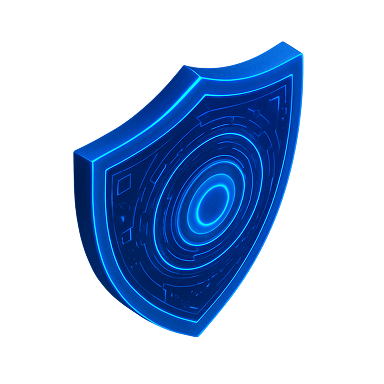

# TryHackMe Writeups

Personal archive of my notes for TryHackMe rooms, networks, modules, learning paths, and challenges.

> This repository is for educational and documentation purposes. Try to solve the content yourself before using these notes when you get stuck.

## Current writeups

Start with the introductory rooms below, then continue with the Linux fundamentals series.

	
	
	
	
	

| Room | Focus | Difficulty |
| --- | --- | --- |
| [Offensive Security Intro](Walkthroughs/Easy/Offensive_Security_Intro.md) | Reconnaissance and web enumeration | Easy |
| [Defensive Security Intro](Walkthroughs/Easy/Defensive_Security_Intro.md) | Blue teams, SOC, DFIR, and SIEM | Easy |
| [Search Skills](Walkthroughs/Easy/Search_Skills.md) | Search engines, OSINT, and vulnerability research | Easy |
| [Linux Fundamentals Part 1](Walkthroughs/Easy/Linux_Fundamentals_Part_1.md) | Linux commands, filesystems, and shell operators | Easy |
| [Linux Fundamentals Part 2](Walkthroughs/Info/Linux_Fundamentals_Part_2.md) | SSH, permissions, and common directories | Info |

## Contents

- [Challenges](Challenges/README.md)
- [Learning Paths](Learning-Paths/README.md)
- [Modules](Modules/README.md)
- [Networks](Networks/README.md)
- [Walkthroughs](Walkthroughs/README.md)

## Difficulty levels

Content is grouped by TryHackMe difficulty whenever possible:

- Easy
- Medium
- Hard
- Info

## Spoiler policy

Flags are not shared in plain text. Flag values are shown as `THM{REDACTED}`.

## Writing standard

Each writeup should follow this structure whenever possible:

1. Room link and difficulty level
2. Learning objectives
3. Reconnaissance and enumeration
4. Techniques and commands used
5. Findings and solution steps
6. Short summary

## Note

TryHackMe content and room names belong to their respective owners. This repository contains personal learning notes only.
